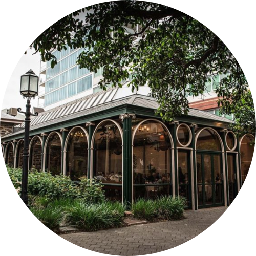

## Ceremony
The day begins at the Adelaide Botanic Gardens with a ceremony on the lawns overlooking the lake. Enter from the main entrance on North Terrace, follow the path straight down turning left at the fork and the ceremony location will be on your right. Please arrive at 2:30pm for a 3pm sharp start.

## Reception

The ceremony will be followed by a reception in The Conservatory at Ayers House. Arrive from 5:30pm for pre-dinner canapes, followed by a three-course sit down dinner. For the period of time between the ceremony and reception take the opportunity to explore the botanic gardens or head up to Rundle Street for a coffee.

