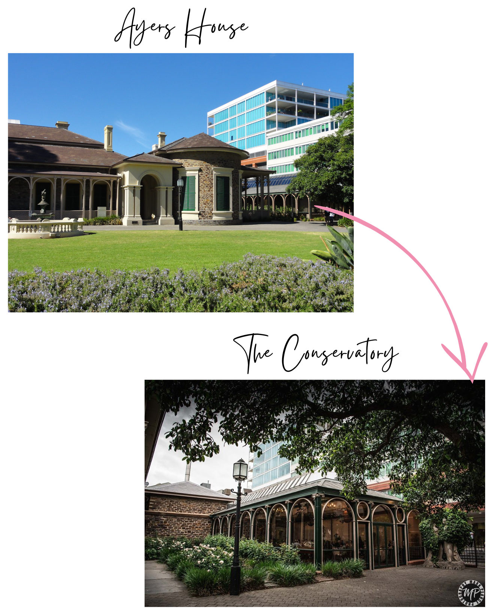

Our wedding day is taking place on Kaurna land in the Adelaide CBD. We would like to acknowledge the Kaurna people as the Traditional Custodians of this land and recognise their deep feelings of attachment and relationship to their Place. In <a href="https://www.nativetitlesa.org/wp-content/uploads/2020/02/SAN0086AboriginalWay0418_web.pdf">2018</a>, Native Title was awarded to the Kaurna people as Traditional Owners of the Adelaide Plains, making Adelaide the first (and currently only) capital city in Australia in which the true ownership of Aboriginal land has been legally recognised. Steven and Holly are both working in the Indigenous space and have had the great privilege to learn from and with Indigenous Australians in education and research settings. We feel very grateful for the opportunity to live, learn and grow on Kaurna Country and it's important to us both to acknowledge the great beauty, resilience and wisdom of the Kaurna people and their land.
 



# Ceremony at Adelaide Botanic Gardens

The day begins at the Adelaide Botanic Gardens with a ceremony on the lawns overlooking Kainka Wirra (*Kaurna place name meaning Red Gum Forest*), the main lake. We recommend entering from the Main Entrance on North Terrace, following the path straight down, turning left at the fork and the ceremony location will be on your right. See the maps above and below for exact locations (if the interactive map above hasn't loaded, refresh the page). Please arrive at 3:00pm as the ceremony will commence at 3:30pm sharp.

# Reception at Ayers House

The ceremony will be followed by a reception in The Conservatory at Ayers House on North Terrace, a short 7 minute walk from the ceremony site. Arrive from 5:30pm for pre-dinner canapes, followed by a three-course sit down dinner. For the period of time between the ceremony and reception, please take the opportunity to explore the botanic gardens or head up to Rundle Street for a coffee or a cocktail!

# Dress Code

The dress code is cocktail attire. It'll be spring so check the weather close to the date, and keep an eye on the website as we'll post any wet-weather plans here. The ceremony will be on the lawn so keep that in mind when choosing your shoes! 



# Kids

To allow all guests to relax and enjoy themselves, we have chosen to make our special day adults only. We thank you for your understanding.

# Social Media

We'll be having an unplugged ceremony so please leave the photo and video recording to the professionals, but you're of course welcome to take photos after the ceremony and throughout the reception. After the wedding, check back here as we'll provide a Google Drive link for all guests to upload any photos they wish to share with us and other guests. You'll also be able to see photos from other guests!

# Transport

There is street parking along Plane Tree Drive, behind the botanic gardens or along East Terrace (hourly rate). There is also underground carparks on Frome Road and Union Street. See [Parkopedia](https://www.parkopedia.com.au/parking/locations/adelaide_botanic_garden_north_tce_adelaide_south_australia_5000_australia_4768r1f965ms0k2046/?country=au&arriving=202307081400&leaving=202307081800) or [Google Maps](https://www.google.com/maps/search/carpark/@-34.9221237,138.6012484,15.86z) for further details. The venues are also easily accessible by public transport, Uber or taxis. 

# Accommodation

There are plenty of hotels nearby if you want to make a night of it and stay in the city. See [here](https://www.booking.com/searchresults.en-gb.html?label=adelaide%2Fcbd-39hasZeOQv161UrfT9_8rQS638077264011%3Apl%3Ata%3Ap180%3Ap2%3Aac%3Aap%3Aneg%3Afi%3Atikwd-2701236770%3Alp9070884%3Ali%3Adec%3Adm%3Appccp%3DUmFuZG9tSVYkc2RlIyh9YZVcNNsENnH02-pWD53qm9c&aid=306395&ss=Adelaide+Botanic+Garden%2C+Adelaide%2C+South+Australia%2C+Australia&ssne=Adelaide+CBD&ssne_untouched=Adelaide+CBD&lang=en-gb&src=searchresults&dest_id=19613&dest_type=landmark&ac_position=0&ac_click_type=b&ac_langcode=en&ac_suggestion_list_length=2&search_selected=true&search_pageview_id=9aee30e5578a0040&ac_meta=GhA5YWVlMzBlNTU3OGEwMDQwIAAoATICZW46F2FkZWxhaWRlIGJvdGFuaWMgZ2FyZGVuQABKAFAA&checkin=2023-10-07&checkout=2023-10-08&group_adults=2&no_rooms=1&group_children=0&sb_travel_purpose=leisure&nflt=ht_id%3D204) for some options. 

