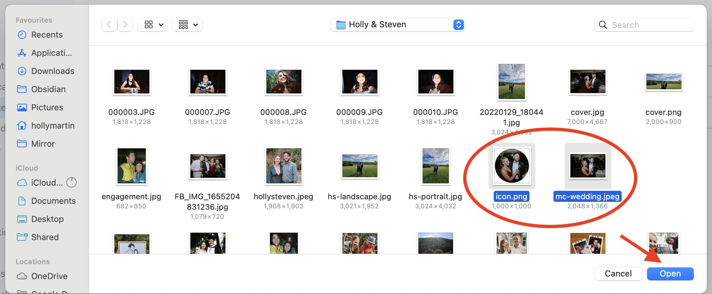

# Help with Uploading Your Photos

To upload your photos, first click on this [link](https://drive.google.com/drive/folders/1E11SZwCFqJdXlVGBmtxOnFMiUCvaJ4E6) which will take you to the Google Drive page.

1. Click on the '+ New' icon in the top left

2. Click on 'File upload'

3. Select the photos you'd like to upload then click 'Open' to upload them to the shared Google Drive (remember that these photos will be shown on the wedding website for other guests to view)

